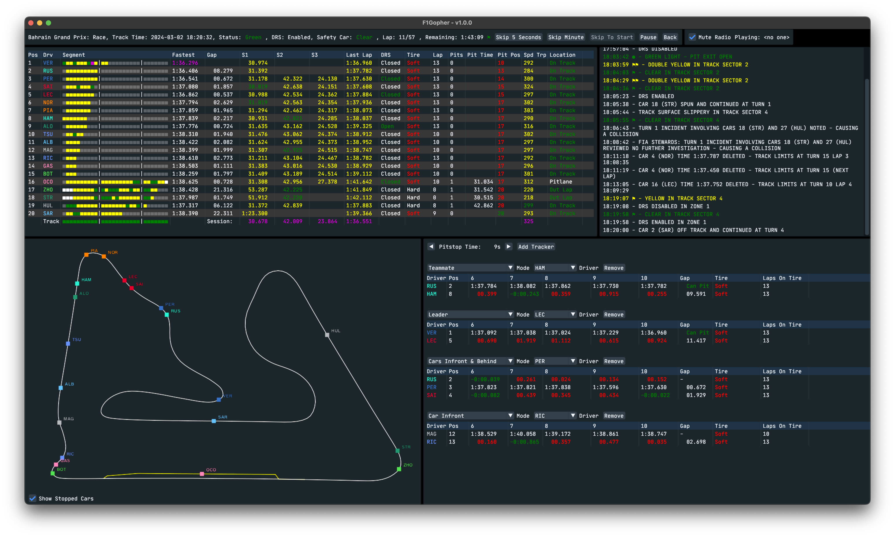
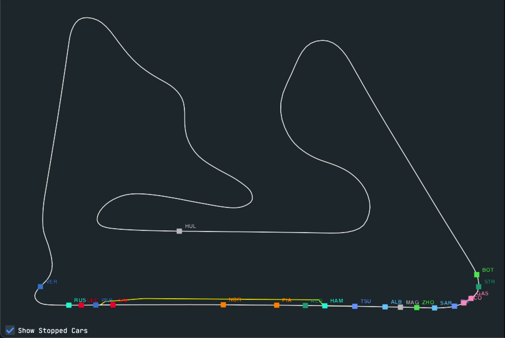

# F1Gopher

F1Gopher is a GUI frontend to the [F1Gopher library](https://github.com/f1gopher/f1gopherlib). 

It allows you to view timing, telemetry and location data and more from Formula 1 events, either live or replays of previous events.

## Features

* Replay all sessions (practices, qualifying, sprint and races) from all events from 2018 to now
* Watch data from sessions lives as they happen
* Watch data from pre-season test sessions live
* Listen to driver radio messages
* Pause and resume live sessions
* Skip forward through replay sessions
* Count down to the next session
* Web server that duplicates the timing view onto a web page

### Timing View

* Driver position
* Segment times for each driver that show if they were faster than their previous best, faster than anyone or slower
* Drivers fastest lap for the session
* Gap to the driver in front or gap to the fastest lap (for qualifying)
* All three sector times and last lap time color to show if the time is a personal best, fastest overall or slower
* DRS open or closed and whether the car is currently within one second of the car in front and potentially able to use DRS
* Current tire being used and number of laps the tire has been used for
* Last speed when going through the speed trap
* Location of the car (on track, outlap, pitlane, stopped...)
* Segment state for the track (is the segment green, yellow or red flagged)
* Fastest sector and laptimes for anyone in that session
* For race sessions shows the estimated position after a pitstop (including gap ahead and behind to the nearest drivers). This is estimated from the time taken to drive through the pitlane plus a configurable expected pitstop time

### Track Map View

* An outline of the track and pitlane
* Locations of all drivers in realtime
* Location of the safety car when active

### Weather View

* Whether it is raining or not
* Air and track temperature
* Wind speed and direction
* Air pressure and humidity

### Radio View

* Plays the drivers radio messages as they happen
* Or mute them

### Race Control Messages View

* Displays all messages from race control

### Telemetry View

* View live telemetry data for a selected driver
* Choose from 6 channels of data to display:
  * Throttle %
  * Brake %
  * RPM
  * Gear
  * Speed
  * DRS

### Race Position View - Race Sessions Only

* See how a drivers position has changed over the course of a race session

### Gapper Tool View - Race Sessions Only

* View [Gapper Tool](https://www.schoolofraceengineering.co.uk/blog/post/15991/build-your-own-race-strategy-gapper-tool/) data used to help predict/plan strategies
* Select a driver to use as the baseline
* Select which drivers to display data for